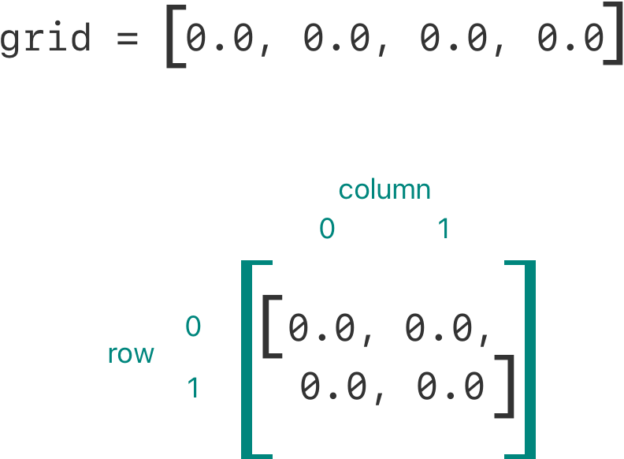
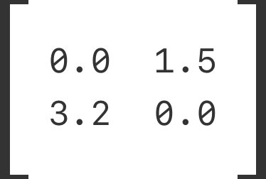

# 서브 스크립트 \(Subscripts\)

클래스, 구조체, 그리고 열거형은 콜렉션, 목록, 또는 시퀀스의 멤버 요소에 접근할 수 있는 단축키인 _서브 스크립트 \(subscripts\)_ 를 정의할 수 있습니다. 설정과 검색을 위한 별도의 메서드 없이 인덱스로 값을 설정하고 조회하기 위해 서브 스크립트를 사용합니다. 예를 들어 `someArray[index]` 로 `Array` 인스턴스에 요소를 접근하고 `someDictionary[key]` 로 `Dictionary` 인스턴스에 요소를 접근합니다.

단일 타입을 위한 여러개 서브 스크립트를 정의할 수 있고 사용할 적절한 서브 스크립트 오버로드는 서브 스크립트에 전달하는 인덱스 값의 타입에 따라 선택됩니다. 서브 스크립트는 단일 차원으로 제한되지 않고 사용자 타입에 맞춰 여러개의 입력 파라미터로 서브 스크립트를 정의할 수 있습니다.

## 서브 스크립트 구문 \(Subscript Syntax\)

서브 스크립트를 사용하면 인스턴스 이름 뒤에 대괄호에 하나 이상의 값을 작성하여 타입의 인스턴스를 조회할 수 있습니다. 이 구문은 인스턴스 메서드 구문과 계산된 프로퍼티 구문과 유사합니다. `subscript` 키워드로 서브 스크립트 정의를 작성하고 인스턴스 메서드와 같은 방법으로 하나 이상의 입력 파라미터와 반환 타입을 작성합니다. 인스턴스 메서드와 다르게 서브 스크립트는 읽기-쓰기 또는 읽기전용이 될 수 있습니다. 이러한 동작은 계산된 프로퍼티와 같은 방법으로 getter와 setter를 통해 동작합니다:

```swift
subscript(index: Int) -> Int {
    get {
        // Return an appropriate subscript value here.
    }
    set(newValue) {
        // Perform a suitable setting action here.
    }
}
```

`newValue` 의 타입은 서브 스크립트의 반환 값과 동일합니다. 계산된 프로퍼티와 마찬가지로 setter의 `(newValue)` 파라미터를 지정하지 않도록 선택할 수 있습니다. 파라미터를 지정하지 않으면 setter에 `newValue` 라는 기본 파라미터가 제공됩니다.

읽기전용 계산된 프로퍼티와 마찬가지로 `get` 키워드와 그것의 중괄호를 삭제하여 읽기전용 서브 스크립트를 쉽게 선언할 수 있습니다:

```swift
subscript(index: Int) -> Int {
    // Return an appropriate subscript value here.
}
```

다음은 정수의 n 배 테이블을 표시하기 위한 `TimesTable` 구조체를 정의하는 읽기전용 서브 스크립트 구현의 예입니다:

```swift
struct TimesTable {
    let multiplier: Int
    subscript(index: Int) -> Int {
        return multiplier * index
    }
}
let threeTimesTable = TimesTable(multiplier: 3)
print("six times three is \(threeTimesTable[6])")
// Prints "six times three is 18"
```

이 예제에서 `TimesTable` 의 새로운 인스턴스는 3배 테이블을 표시하기 위해 생성됩니다. 인스턴스의 `multiplier` 파라미터를 사용하는 값으로 구조체의 `initializer` 에 `3` 의 값을 전달하여 나타냅니다.

`threeTimesTable[6]` 에 대한 호출에 보여준 것처럼 서브 스크립트를 호출하여 `threeTimesTable` 인스턴스를 조회할 수 있습니다. 이것은 `3` 의 `6` 배인 `18` 의 값을 반환하는 3배 테이블에서 6번째 값을 요청합니다.

> NOTE _n_ 배 테이블은 수학적 규칙을 기반으로 합니다. `threeTimesTable[someIndex]` 를 새로운 값을 설정하는 것은 적절하지 않으므로 `TimesTable` 의 서브 스크립트는 읽기전용 서브 스크립트로 정의됩니다.

## 서브 스크립트 사용 \(Subscript Usage\)

"서브 스크립트"의 정확한 의미는 사용되는 컨텍스트에 따라 다릅니다. 일반적으로 서브 스크립트는 콜렉션, 목록, 또는 시퀀스에 멤버 요소에 접근하는 바로가기로 사용됩니다. 특정 클래스 또는 구조체의 기능에 가장 적합한 방식으로 서브 스크립트를 자유롭게 구현할 수 있습니다.

예를 들어 Swift의 `Dictionary` 타입은 `Dictionary` 인스턴스에 저장된 값을 설정하고 조회하기 위해 서브 스크립트를 구현합니다. 서브 스크립트 대괄호 내에 딕셔너리의 키 타입의 키를 제공하고 딕셔너리의 값 타입의 값을 서브 스크립트에 할당하여 딕셔너리에 값을 설정할 수 있습니다:

```swift
var numberOfLegs = ["spider": 8, "ant": 6, "cat": 4]
numberOfLegs["bird"] = 2
```

위의 예제는 `numberOfLegs` 라는 변수를 정의하고 3개의 키-값 쌍을 포함하는 딕셔너리를 초기화합니다. `numberOfLegs` 딕셔너리의 타입은 `[String: Int]` 로 유추됩니다. 딕셔너리가 생성된 후에 이 예제는 딕셔너리에 `"bird"` 의 `String` 키와 `2` 의 `Int` 값을 추가하기 위해 서브 스크립트 할당을 사용합니다.

`Dictionary` 서브 스크립트에 대한 자세한 내용은 [딕셔너리 접근과 수정 \(Accessing and Modifying a Dictionary\)](https://docs.swift.org/swift-book/LanguageGuide/CollectionTypes.html#ID116) 을 참고 바랍니다.

> NOTE Swift의 `Dictionary` 타입은 _옵셔널_ 타입을 가지고 반환하는 서브 스크립트 인 키-값 서브 스크립트를 구현합니다. 위의 `numberOfLegs` 딕셔너리에서 키-값 서브 스크립트는 타입 `Int?` 또는 "옵셔널 int"의 값을 가지고 반환합니다. `Dictionary` 타입은 모든 키에 값이 있지 않다는 사실을 모델링 하고 키의 값에 `nil` 을 할당하여 키의 값을 삭제하는 방법을 제공하기 위해 옵셔널 서브 스크립트 타입을 사용합니다.

## 서브 스크립트 옵션 \(Subscript Options\)

서브 스크립트는 여러개의 입력 파라미터를 가질 수 있고 입력 파라미터는 어떤 타입도 가능합니다. 서브 스크립트는 어떤 타입도 반환할 수도 있습니다.

함수 처럼 서브 스크립트는 [가변 파라미터 \(Variadic Parameters\)](https://docs.swift.org/swift-book/LanguageGuide/Functions.html#ID171) 와 [파라미터 기본값 \(Default Parameter Values\)](https://docs.swift.org/swift-book/LanguageGuide/Functions.html#ID169) 에서 설명 했듯이 가변 파라미터와 파라미터에 기본값을 가질 수 있습니다. 그러나 함수와 다르게 서브 스크립트는 in-out 파라미터를 사용할 수 없습니다.

클래스 또는 구조체는 필요한 만큼 서브 스크립트 구현과 값의 타입 또는 서브 스크립트 대괄호 내에서 포함된 값을 기반으로 유추하여 적절한 서브 스크립트를 제공할 수 있습니다. 이러한 여러개의 서브 스크립트 정의를 _서브 스크립트 오버로딩 \(subscript overloading\)_ 이라 합니다.

대부분 서브 스크립트는 하나의 파라미터를 가지지만 적절한 타입에 경우 여러개의 파라미터를 가진 서브 스크립트를 정의할 수도 있습니다. 다음의 예제는 `Double` 값의 2차 행렬을 나타내는 `Matrix` 구조체를 정의합니다. `Matrix` 구조체의 서브 스크립트는 2개의 정수 파라미터를 가집니다:

```swift
struct Matrix {
    let rows: Int, columns: Int
    var grid: [Double]
    init(rows: Int, columns: Int) {
        self.rows = rows
        self.columns = columns
        grid = Array(repeating: 0.0, count: rows * columns)
    }
    func indexIsValid(row: Int, column: Int) -> Bool {
        return row >= 0 && row < rows && column >= 0 && column < columns
    }
    subscript(row: Int, column: Int) -> Double {
        get {
            assert(indexIsValid(row: row, column: column), "Index out of range")
            return grid[(row * columns) + column]
        }
        set {
            assert(indexIsValid(row: row, column: column), "Index out of range")
            grid[(row * columns) + column] = newValue
        }
    }
}
```

`Matrix` 는 `rows` 와 `columns` 라는 2개의 파라미터를 가지고 `Double` 타입의 `rows * columns` 값을 저장할 수 있는 큰 배열을 생성하는 초기화를 제공합니다. 행렬의 각 위치는 `0.0` 의 초기값이 주어집니다. 이를 위해 배열의 크기와 초기 셀 값 `0.0` 이 올바른 크기의 새로운 배열을 생성하고 초기화하는 배열 초기화에 전달됩니다. 이러한 초기화는 [기본값을 가진 배열 생성 \(Creating an Array with a Default Value\)](https://docs.swift.org/swift-book/LanguageGuide/CollectionTypes.html#ID501) 에 자세히 설명되어 있습니다.

적절한 행과 열의 수를 초기화로 전달하여 새로운 `Matrix` 인스턴스를 생성할 수 있습니다:

```swift
var matrix = Matrix(rows: 2, columns: 2)
```

위의 예제는 2행과 2열을 가지는 새로운 `Matrix` 인스턴스를 생성합니다. `Matrix` 인스턴스의 `grid` 배열은 왼쪽 상단에서 오른쪽 하단으로 읽는 것처럼 행렬의 평면화 버전입니다:



행렬의 값은 콤마로 구분된 서브 스크립트에 행과 열 값을 전달하여 설정될 수 있습니다:

```swift
matrix[0, 1] = 1.5
matrix[1, 0] = 3.2
```

이 2개의 구문은 행렬의 우측 상단 \(`row` 가 `0` 이고 `column` 이 `1`\)에 `1.5` 값을 설정하고 좌측 하단 \(`row` 가 `1` 이고 `column` 이 `0`\)에 `3.2` 값을 설정하기 위해 서브 스크립트의 setter를 호출합니다:



`Matrix` 서브 스크립트의 getter와 setter 둘다 서브 스크립트의 `row` 와 `column` 값이 유효한지 판단하기 위해 어설션 \(assertion\)이 포함됩니다. 어설션을 지원하기 위해 `Matrix` 는 요청한 `row` 와 `column` 이 행렬의 범위안에 있는지를 판단하기 위해 `indexIsValid(row:column:)` 이라는 편리한 메서드를 포함합니다:

```swift
func indexIsValid(row: Int, column: Int) -> Bool {
    return row >= 0 && row < rows && column >= 0 && column < columns
}
```

어셜션은 행렬 범위를 넘어서 서브 스크립트를 접근하려고 하면 트리거 됩니다:

```swift
let someValue = matrix[2, 2]
// This triggers an assert, because [2, 2] is outside of the matrix bounds.
```

## 타입 서브 스크립트 \(Type Subscripts\)

위에서 설명했듯이 인스턴스 서브 스크립트는 특정 타입의 인스턴스를 호출하는 서브 스크립트 입니다. 타입 자체에서 호출되는 서브 스크립트도 정의할 수 있습니다. 이런 종류의 서브 스크립트를 _타입 서브 스크립트 \(type subscript\)_ 라고 합니다. `subscript` 키워드 전에 `static` 키워드를 작성하여 타입 서브 스크립트를 나타냅니다. 클래스는 하위 클래스가 수퍼 클래스의 서브 스크립트의 구현을 재정의 할 수 있게 대신 `class` 키워드를 사용할 수 있습니다. 아래 예제는 타입 서브 스크립트를 어떻게 정의하고 호출하는지 보여줍니다:

```swift
enum Planet: Int {
    case mercury = 1, venus, earth, mars, jupiter, saturn, uranus, neptune
    static subscript(n: Int) -> Planet {
        return Planet(rawValue: n)!
    }
}
let mars = Planet[4]
print(mars)
```

